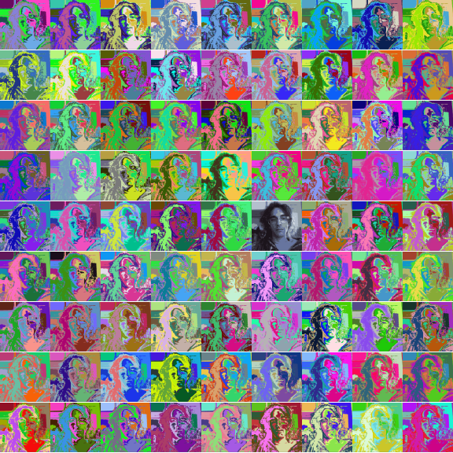

# IOGIF (MAUROCONTE)

RANDOM *made with Python*.

## 9x9 *(script-9x9.py)*
Inspired by The Marilyn Diptych by Andy Warhol

```python script-9x9.py```
<!--  -->

## GIF *(script-gif.py)*
Inspired by The Marilyn Diptych by Andy Warhol

```python script-gif.py```
<!--  -->

## QR *(script-qr.py)*
Inspired by modern nonsense

```python script-qr.py```
